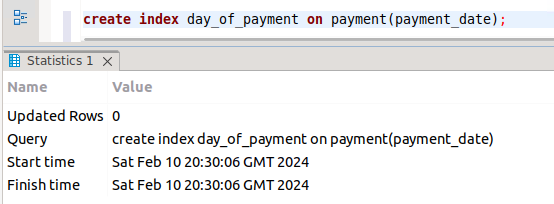

# Домашнее задание к занятию «SQL. Индексы» - Михалёв Сергей

---

### Задание 1

Напишите запрос к учебной базе данных, который вернёт процентное отношение общего размера всех индексов к общему размеру всех таблиц.

**Решение**

```sql
SELECT SUM(index_length)/SUM(data_length)*100 AS percentage 
FROM INFORMATION_SCHEMA.TABLES
WHERE TABLE_TYPE = 'BASE TABLE'
AND TABLE_SCHEMA = 'sakila';
```

- результат
  
  

---

### Задание 2

Выполните explain analyze следующего запроса:
```sql
select distinct concat(c.last_name, ' ', c.first_name),
sum(p.amount) over (partition by c.customer_id, f.title)
from payment p, rental r, customer c, inventory i, film f
where date(p.payment_date) = '2005-07-30'
and p.payment_date = r.rental_date
and r.customer_id = c.customer_id
and i.inventory_id = r.inventory_id;
```
- перечислите узкие места;
- оптимизируйте запрос: внесите корректировки по использованию операторов, при необходимости добавьте индексы.

**Решение.**
**Анализ скрипта**

Результат выполнения скрипта:
  
  

Результат выполнения запроса с EXPLAIN FORMAT = tree
  
  

  Спускаясь по иерархии дерева через Здесь *Nested loop inner join* - вложенные петли внутреннего объеденения таблиц ``from payment p, rental r, customer c, inventory i, film f``` для [агрегирующей оконной функции](https://habr.com/ru/articles/664000/) *SUM* можно определить наиболее тонкие места: 
   - Хэширование *Inner hash join* внутреннее хэширование и поиск по индексу
   - Фильтрация *Filter: (cast(p.payment_date as date)* выполнение условия WHERE и сканирование всей таблицы *payment*

Только поиск в таблице *film* осуществляется по индексам (результат выполнения запроса с EXPLAIN).
  
  

**Оптимизация**

Выборка из таблицы film не вляет на конечный результат и упрощение функции до ```sum(p.amount) over (partition by c.customer_id)``` не меняет итоговой картины. Так же напрямую можно связать платежи с клиентом, уменьшая список таблиц.
  

Теперь в дереве работы анализа скрипта основной лимитирующий процесс- фильтрация данных по дате покупки: *Filter: (cast(p.payment_date as date) = '2005-07-30')  (cost=1633 rows=16086)*


Здесь для оптимизации процесса можно создать индекс: ```create index day_of_payment on payment(payment_date);```




Но эффекта это не возымело:


Далее решил избавится от оконной функции, тем самым упростить сам запрос:

```
select distinct 
concat(c.last_name, ' ', c.first_name), 
sum(p.amount)
from payment p JOIN customer c on p.customer_id  = c.customer_id 
where date(p.payment_date) = '2005-07-30' 
group by p.customer_id;
```
Сам результат выборки не изменился (см. JOHNSON PATRICIA):


Результаты анализа на этот раз показал значительное ускаорение процесса.


---

